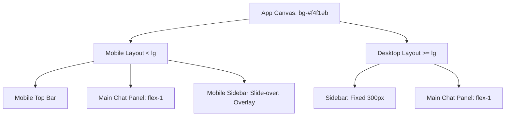

# UI Layout & Design Documentation

This document describes the design architecture, visual system, component hierarchy, and responsive behavior of the Climate Risk A.I. Frontend Prototype.

---

## 1. Visual Theme & Color Palette

The application uses a clean, premium, warm minimalist aesthetic. Instead of generic stark blacks and whites or saturated blues, it adopts soft, natural tones inspired by environment and climate documents.

### Colors
*   **Canvas Background:** `#f4f1eb` — A warm sand/beige tone that frames the dashboard layout.
*   **Main Chat Container:** `#f8f6f1` — A slightly lighter warm sand tone for the main panel background.
*   **Card & Sidebar Backgrounds:** `#ffffff` — Pure white is used to lift important containers off the sand canvas.
*   **Dark Accents & Primary Elements:** `bg-neutral-950` (`#0a0a0a`) — Used for primary buttons, user message bubbles, and the brand icon.
*   **Subtle Borders:** `border-black/5` — Soft borders to establish structure without heavy lines.
*   **Muted Text & Details:** `text-neutral-400` / `text-neutral-500` / `text-neutral-700` — For readability and visual hierarchy.

---

## 2. Layout Structure

The layout is built as a single-page dashboard application.

### Desktop Layout (`lg` screen size and larger)
*   **Grid:** Side-by-side flexbox container with a gap of `4` (`1rem`).
*   **Height:** Constrained to `h-[calc(100vh-2rem)]` with a standard screen padding of `p-4` to create a framed floating application view.
*   **Left Column (Sidebar):** A fixed width container `w-[300px]` that shrinks to fit (`shrink-0`).
*   **Right Column (Main Chat):** A flexible container (`flex-1`) that expands to occupy the remaining screen width.

### Mobile Layout (smaller than `lg` screen size)
*   **Grid:** Stacked vertical flex layout.
*   **Top Bar:** Visible on mobile (`lg:hidden`). Contains:
    *   A "Menu" button on the left to reveal the slide-over sidebar.
    *   Branding indicators ("Climate Risk A.I." / "Frontend prototype") on the right.
*   **Sidebar Slide-over:** A backdrop overlay (`bg-black/25` fixed inset) containing the same `<Sidebar>` component styled to occupy the left side of the screen (`absolute left-3 top-3 bottom-3`).
*   **Main Chat:** Occupies the rest of the height below the mobile top bar.

---

## 3. Component Breakdown

### A. Sidebar Component (`Sidebar.jsx`)
The sidebar organizes app metadata, navigation, actions, and settings. It is styled with `rounded-[32px]` corners.

1.  **Header:**
    *   A rounded black tile (`h-11 w-11 rounded-2xl bg-neutral-950`) with a white "C" character.
    *   App titles: "Climate Risk A.I." and "PICT uncertainty chatbot".
2.  **Quick Actions:**
    *   **New Chat Button:** Large, high-priority button (`bg-neutral-950 hover:bg-neutral-800 text-white`) with a plus (`+`) indicator.
    *   **Search Bar:** An input box (`bg-neutral-50`) featuring a search symbol (`⌕`) and an interactive clear button (`×`) when text is typed.
3.  **Conversation List:**
    *   A dashed-border inner box (`border-dashed border-neutral-200 bg-neutral-50/50 rounded-[24px]`) containing the local chat history list.
    *   *Active State:* Highlighted with `bg-neutral-950 text-white`.
    *   *Inactive State:* White background with subtle hover effects (`hover:bg-neutral-100`).
    *   *Metadata:* Shows conversation title, date of last update, latest message preview, and an inline **Delete** button.
4.  **Footer Controls:**
    *   Direct links to **Settings** and **Help & documentation**.
    *   User profile card displaying a mock avatar ("E" on gray backdrop) and user metadata ("Efe" / "Frontend prototype").

### B. Main Chat Component (`MainChat.jsx`)
The workspace container where users interact with the climate A.I. It features a curved container (`rounded-[28px]`) with `overflow-hidden` to prevent layout breaking during scrolling.

1.  **Scrollable Message Space:**
    *   **Empty State (Intro Dashboard):**
        *   Intro badge: *"Climate Risk Uncertainty Visualization"*
        *   Welcome text: *"Good day! How may I assist you today?"*
        *   Description copy outlining capabilities.
        *   **Starter Prompts Grid:** Displays suggested question cards in a responsive layout (`grid-cols-1 md:grid-cols-2 xl:grid-cols-3`):
            *   *Explore:* "Show climate risk patterns across Fiji."
            *   *Explain:* "Explain projection uncertainty in simple terms."
            *   *Compare:* "Compare wet-bulb trends across Pacific islands."
            *   *Map:* "Generate a map of high-risk areas."
            *   *Trends:* "Summarize projected changes over time."
            *   *Limitations:* "What uncertainty should I consider before making a decision?"
    *   **Chat State (Conversation History):**
        *   User bubbles: Right-aligned, dark (`bg-neutral-950 text-white`).
        *   A.I. bubbles: Left-aligned, light (`bg-white text-neutral-700 border border-black/5`).
        *   Typing feedback: `TypingDots` showing three pulsing grey dots with staggered delays (`animate-bounce`).
2.  **Bottom Text Input Panel (`ChatInput.jsx`):**
    *   A clean text area that auto-wraps text with a maximum height (`max-h-32 min-h-[44px]`).
    *   A circular send button (`h-11 w-11 rounded-full bg-neutral-950 text-white`) containing an up arrow (`↑`).
    *   Disclaimer text explaining prototype limitations.

---

## 4. Overlay Modals

Both modals are rendered inside a fixed modal backdrop (`fixed inset-0 bg-black/20 z-50 flex items-center justify-center`) and have a curved layout (`rounded-[32px] bg-white`).

### Settings Modal (`SettingsModal.jsx`)
Features a tabbed window allowing users to toggle prototype parameters:
*   **Navigation Tabs:** Preferences, Data, and Prototype toggle tabs in a pill-shaped button bar (`bg-neutral-100`).
*   **Preferences Tab:** Select theme preferences (Light / Dark / System placeholder) and units (Metric / Imperial).
*   **Data Tab:** Default region dropdown selectors (Fiji, Kiribati, Tonga, etc.) and a custom-designed toggle switch (`SettingToggle`) for uncertainty notes.
*   **Prototype Tab:** Toggle for warning notices and backend connection status indicator card.

### Help Modal (`HelpModal.jsx`)
A clean reading panel displaying sections detailing the features of the prototype, current capabilities (such as browser `localStorage` usage), sample commands, and integration gaps.

---

## 5. Missing & Placeholder Design Elements

This prototype is a pure frontend layout without advanced integrations or full assets. Below are the key missing design elements:

### Typography & Custom Fonts
*   **Current State:** The application falls back entirely to the default Tailwind/system sans-serif font stack (`ui-sans-serif, system-ui, sans-serif`).
*   **Gap:** There are no custom typography styles or web font imports (e.g., Google Fonts or locally hosted web fonts).
*   **Recommendation:** To achieve a highly refined editorial feel, the design system should introduce a modern geometric sans-serif (e.g., **Outfit**, **Inter**, or **Geist Sans**) for the UI controls and a readable serif or high-contrast display font for headers to emphasize Climate Risk documentation layout styles.

### Icons & Asset System
*   **Current State:** The UI uses raw Unicode character icons (`+`, `⌕`, `×`, `↑`) directly in text tags.
*   **Gap:** No dedicated svg/vector icon package is installed.
*   **Recommendation:** Integrate a package like `lucide-react` or custom SVG assets to replace raw text symbols with uniform, scalable vector icons.

### Charting & Mapping Visualizations
*   **Current State:** There is no visualization framework configured in `package.json`.
*   **Gap:** Despite the project name mentioning *"Climate Risk Uncertainty Visualization"*, the frontend does not contain any library to render climate maps, uncertainty graphs, spatial risk maps, or trends.
*   **Recommendation:** Install and design custom visualization components using a mapping tool (such as Mapbox GL / Leaflet) and chart package (such as Recharts / D3) to dynamically display geospatial risk distributions and probability charts.

### Dark Theme CSS styles
*   **Current State:** The settings modal lists options for "Dark later" or "System later" under Preferences, but these options are non-functional placeholders.
*   **Gap:** The tailwind style sheets contain zero dark-mode selector overrides (e.g. `dark:bg-neutral-950`).
*   **Recommendation:** Configure Tailwind CSS to enable dark mode class selection and design a matching dark theme using deep slate/green canvas colors to complement the warm light theme.

### Micro-Animations
*   **Current State:** Basic hover scaling/shadow animations and a standard bounce typing indicator.
*   **Gap:** Transition states (like sidebars sliding in, modals fading, and chat messages fading/sliding up) use standard CSS opacity toggles rather than fluid physics-based transitions.
*   **Recommendation:** Introduce `framer-motion` or transition utilities to enable natural physics-based movements for dashboard panels and slide-outs.
