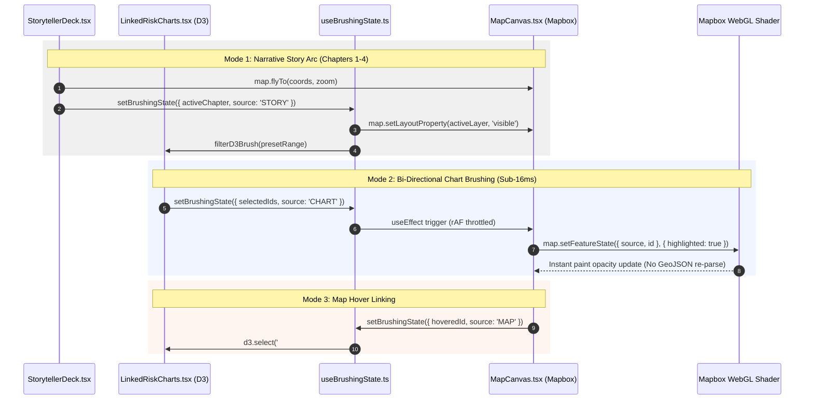

## Context

The `pict-climate-risk-viz-chatbot` prototype currently renders geospatial Mapbox layers and H3 heat risk grids over Pacific SIDS, but lacks interactive non-spatial charts (scatterplots, histograms) and narrative scrollytelling for competition judging. This architecture introduces bi-directional brushing and linking between Mapbox GL JS and D3.js distribution charts, driven by a 4-chapter narrative storytelling deck ("Rising Tides, Heat & Human Resilience") and official Pacific Data Hub SDMX indicators.

## System Architecture Diagram

## Goals / Non-Goals

**Goals:**
- **60fps Interactivity**: Use Mapbox GPU `map.setFeatureState()` so brush gestures update visual layers sub-16ms without re-parsing GeoJSON.
- **4-Chapter Story Engine**: Build a guided narrative control bar (`StorytellerDeck.tsx`) driving camera moves, preset threshold filters, and layer toggles.
- **Data Provenance Badges**: Explicitly cite Pacific Community (SPC) / Pacific Data Hub (PDH) SDMX endpoints on all charts and tooltips.
- **Antimeridian Longitude Wrap Fix**: Fix H3 polygon tearing across the +180°/-180° date line in Fiji and Kiribati inside `h3Binner.js`.
- **Reuse Assets**: Re-use `earthlab-fiji-map` 3x3 bivariate risk palette and 111 Fiji CHVA health facility dataset.

**Non-Goals:**
- Replacing existing chatbot API endpoints or server routes.
- Refactoring `server.js` (tracked independently by GH Issue #2).
- Adding heavy external chart libraries like Plotly (D3 micro-modules keep bundle lightweight).

## Decisions

### Decision 1: Shared Reactive Store (`useBrushingState.ts`) with Source Attribution
- **Rationale**: To prevent infinite callback loops between Mapbox `mousemove` and D3 `d3-brush` events, every selection update carries a `source` tag (`"MAP" | "CHART" | "STORY"`). Listeners ignore updates originating from themselves.
- **Alternative Considered**: Global Redux store (too heavy, causes full React tree re-renders per mousemove frame).

### Decision 2: GPU Highlighting via `map.setFeatureState()`
- **Rationale**: Updating feature state in GPU memory is instant (<2ms) compared to mutating GeoJSON payloads or updating Mapbox layer filters (16-100ms layout re-calculation).
- **Alternative Considered**: `map.getSource().setData()` on every mouse drag (causes frame drops and main thread lag).

### Decision 3: Centroid-Relative Longitude Wrapping in `h3Binner.js`
- **Rationale**: H3 hexagon coordinates across Fiji (Taveuni) and Kiribati cross the 180° meridian. Relative wrapping against polygon centroids prevents coordinate wrapping across the world map.

## Risks / Trade-offs

- **[Risk] High feature count on D3 SVG scatterplot**: D3 SVG circle elements can slow down if rendering > 2,000 points simultaneously.
  - *Mitigation*: Limit scatterplot points to active admin region / H3 cell summary count (~100–300 features max).
- **[Risk] Mapbox style loading race condition**: `setFeatureState` fails if called before Mapbox layer style is loaded.
  - *Mitigation*: Guard `setFeatureState` calls with `mapboxMap.isStyleLoaded()` and `once('idle')` checks.

## Verification Recovery Patches

Verification found an incomplete implementation of the architecture above. The
following patches are required before this change can be considered complete.

1. **Feature-state and identity contract ([#4](https://github.com/BrownEarthLab/pict-climate-risk-viz-chatbot/issues/4))**
   - Replace mock chart IDs with a stable ID shared by chart records and Mapbox
     H3/asset features.
   - Use an rAF-throttled effect to call `map.setFeatureState()` for selected
     records and remove stale highlight state when selection changes.
   - Add the specified histogram and `d3.brushX` threshold selection.

2. **Map-to-chart event contract ([#5](https://github.com/BrownEarthLab/pict-climate-risk-viz-chatbot/issues/5))**
   - Register CHVA facility and H3 hover/click handlers, propagate events with
     `source: "MAP"`, and enrich the CHVA tooltip with provenance.
   - The chart must consume the same identity contract so it can outline the
     corresponding mark without feedback loops.

3. **Story-driven filters ([#6](https://github.com/BrownEarthLab/pict-climate-risk-viz-chatbot/issues/6))**
   - Chapters must set both map presentation and a defined chart preset.
   - Add explicit sequential navigation and an open-exploration reset that
     clears story filters while leaving ordinary brushes available.

4. **Executable visual verification ([#7](https://github.com/BrownEarthLab/pict-climate-risk-viz-chatbot/issues/7))**
   - Browser tests must use Playwright's configured `baseURL`; the current
     storyteller spec hard-codes port 5174 while Playwright starts port 5173.
   - Repair the dynamic layer toggle regression and cover CHVA visibility,
     feature-state brushing, and map-to-chart linking.

## Latest Presentation Decisions

- **Fiji detail level**: Story presets for Chapters 1 and 2 use H3 resolution 7;
  broader Pacific presets use resolution 5. This keeps the Fiji-focused view
  detailed without forcing the same cell count across all PICT islands.
- **Map workspace**: The analysis rail collapses to a compact control instead of
  retaining a 300px overlay while hidden.
- **Facility encoding**: CHVA points use categorical facility-type colors rather
  than vulnerability colors. Hospitals are red, Health Centres orange, and
  Nursing Stations blue; vulnerability remains available in the tooltip data.
- **H3 land mask**: Sea-level cells use resolution 7 and are filtered by a
  centroid-in-source-polygon check before becoming GeoJSON features. This
  removes cells whose representative point is in water while retaining the
  underlying polygon boundaries for valid land-centred cells.
- **Rail collapse**: The analysis controls rail transitions between its normal
  full-height/300px layout and a compact square toggle, allowing both horizontal
  and vertical map space to be reclaimed.
