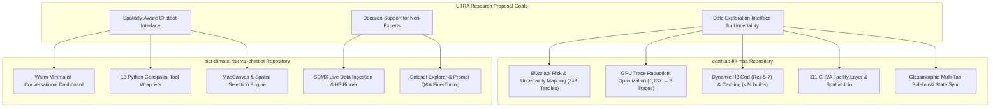
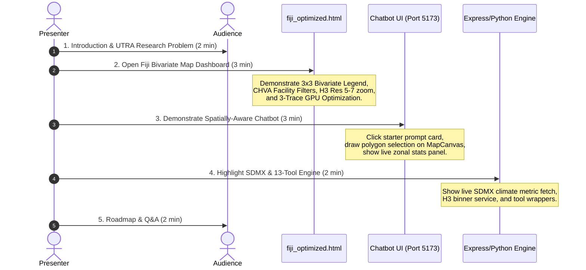

# UTRA Project Master Demo & Report Plan
## Spatially-Aware Climate Risk Visualization & Decision-Support Chatbot for PICTs

---

## 1. Project Context & Proposal Alignment

### Research Background
Pacific Island Countries and Territories (PICTs) face extreme vulnerability to climate impacts, yet are underrepresented in global climate models (GCMs). Key drivers like Tropical Cyclones (TCs) and localized coastal dynamics are poorly resolved in coarse CMIP ensembles. Furthermore, multidimensional model output and uncertainty make raw datasets inaccessible to local decision makers.

### Original Project Proposal
*"The output is expected to make it easier to ask questions and get answers from large geospatial datasets, making the process more effortless and accessible to a broader audience. It also provides an open AI framework for spatially aware chatbots that deliver not only descriptive text but also geographic insights and visualizations."*

### UTRA Summer Expectations vs. Current Achievements

---

## 2. Comprehensive Feature Log & Ownership

### A. Your Contributions (`slowbutfast`)

#### 1. Interactive Fiji Bivariate Climate Map (`earthlab-fiji-map`)
* **2D Bivariate Choropleth Classification**: Implemented a 3x3 bivariate matrix combining temperature mean (`raster_mean` terciles) and climate projection uncertainty (`raster_std` / alpha terciles) into a 9-class color overlay (`bivariate.py`).
* **GPU Trace Optimization**: Solved severe page latency by refactoring 1,136 separate `Scattermapbox` traces into **3 static GPU layers** (`Choroplethmapbox` for subdivisions and hexagons, `Scattermapbox` for markers).
* **Dynamic H3 Grid System & Build Caching**: Developed multi-resolution H3 spatial binning (resolutions 5, 6, 7) backed by a geometric cache (`data/cache/`), reducing compilation times from **~30s down to <2s**.
* **111 CHVA Facility Integration**: Integrated the complete Climate Change and Health Vulnerability Assessment dataset using GeoPandas spatial joins (`gpd.sjoin`) with color-tier state preservation during interactive filtering.
* **Glassmorphic Multi-Tab UI & State Engine**: Created a multi-tab sidebar (Map Config, Filters, Facility Directory) controlled by unified client-side state synchronization (`filterState`).
* **Modular Package Architecture**: Refactored processing code into the installable `fiji_map` Python package with automated pipeline triggers (`run_pipeline.py`).
* **Automated E2E Test Suite**: Built headless Playwright E2E browser tests (`test_e2e_filters.py`) and PyTest unit tests (`test_bivariate.py`).

#### 2. Chatbot Map Engine & Backend Services (`pict-climate-risk-viz-chatbot`)
* **Interactive MapCanvas**: Built `MapCanvas.tsx` and `useMapbox` hook featuring dynamic Mapbox sources, thin boundary outlines, hover tooltips, and decoupled layer visibility controls.
* **Spatial Query & Zonal Statistics**: Created `SpatialQueryPanel.tsx` and `DrawControls.tsx` for drawing bounding polygons, running spatial queries, and returning real-time zonal statistics.
* **SDMX Live Backend Infrastructure**: Architected Express backend (`server.js`) with modular services: `sdmxApiClient.js` (live SDMX metrics), `cacheManager.js`, `h3Binner.js`, and `coordinator.js`.
* **Dataset Explorer & Fine-Tuning Tooling**: Created frontend views for historical temperature and wet-bulb temperature, as well as prompt dataset generators for LLM fine-tuning.
* **E2E WebGL Testing Infrastructure**: Integrated Playwright browser testing for Mapbox GL JS spatial selections and UI state updates.

---

### B. Partner's Contributions (`yigit-efe-enhos` / Efe)

#### 1. Conversational UI & User Experience
* **Warm Minimalist Dashboard Layout**: Designed main chat UI (`MainChat.jsx`, `Sidebar.jsx`, `ChatInput.jsx`), adopting soft natural sand tones (`#f4f1eb`) suited for scientific documents.
* **Guided Starter Prompt Cards**: Authored guided starter cards ("Explore climate risk in Fiji", "Explain projection uncertainty", "Compare wet-bulb trends") to onboard non-expert decision makers.
* **Settings & Guidance Modals**: Built `SettingsModal.jsx` (region selector for Fiji/Kiribati/Tonga, backend status indicator) and `HelpModal.jsx`.

#### 2. Analytical Geospatial Tool Suite & Region Registry
* **13-Tool Analytical Python Engine**: Implemented LLM function-calling wrappers under `backend/tools/geospatial/`:
  - `spatial.py` & `region.py`: Spatial filtering, administrative boundary queries, PICT region lookup.
  - `climate.py`, `extremes.py`, `thresholds.py`: Climate anomaly detection, extreme temperature counts, threshold exceedances.
  - `statistics.py`, `aggregation.py`, `temporal.py`: Spatial/temporal aggregation, variance quantification, ensemble trend generation.
  - `exposure.py`, `assets.py`, `ranking.py`, `asset_ranking.py`: Asset exposure calculation and risk vulnerability ranking.
* **PICT Region Registry & Heat Risk Workflow**: Created structured lookup structures and UI workflows to analyze heat exposure across Pacific island regions.

---

## 3. Outstanding Features Required to Complete Proposal

| Priority | Outstanding Feature | Target Location | Description & Technical Solution |
| :--- | :--- | :--- | :--- |
| 🔴 **P0** | **End-to-End LLM Function Calling Execution Loop** | `backend/server.js` & `backend/tools/` | Connect Express server to Python tool wrappers via formal JSON Schemas so natural language user prompts trigger real-time tool execution and return GeoJSON + stats. |
| 🔴 **P0** | **Dynamic Trend & Uncertainty Charts** | `frontend/src/components/` | Add Recharts/D3 panels to the sidebar rendering probability distributions and historical vs. 2050/2100 ensemble trend lines with shaded standard deviation variance bands. |
| 🟡 **P1** | **True CMIP6 Ensemble Variance (`raster_std`)** | `earthlab-fiji-map/bivariate.py` | Replace mock alpha metric (`alpha_mock`) with actual spatial standard deviation calculated across CMIP6 ensemble models. |
| 🟡 **P1** | **Tropical Cyclone (TC) Risk Datasets** | `data/` & `backend/tools/exposure.py` | Ingest TC track hazard maps and storm surge inundation proxies, extending `exposure.py` to calculate facility risk against cyclone vectors. |
| 🟢 **P2** | **RAG Engine for IPCC Literature** | `backend/services/rag/` | Vector-index IPCC regional reports and SPREP briefings in ChromaDB/pgvector to provide geographically grounded literature citations. |
| 🟢 **P2** | **Low-Bandwidth Dashboard Optimization** | `earthlab-fiji-map/run_pipeline.py` | Load Plotly.js via CDN and fetch H3 grids dynamically, reducing `fiji_optimized.html` size from 18 MB to **<500 KB**. |
| 🔵 **P3** | **React Flow Visual Workflow Graph** | `frontend/src/components/flow/` | Render interactive node graphs showing how the LLM routed user prompts through input datasets, tools, and aggregation steps. |

---

## 4. Master Live Demo Plan & Talking Points (12 Minutes)

### Minute-by-Minute Live Script

* **[0:00 - 2:00] Context & Problem Statement**:
  - *"Pacific Small Islands are on the frontline of climate risk, yet GCMs fail to resolve local island dynamics and cyclone impacts. Our goal was twofold: build an intuitive bivariate data exploration interface and create a spatially-aware AI chatbot."*
* **[2:00 - 5:00] Demo Part 1 — Fiji Interactive Map (`fiji_optimized.html`)**:
  - Open map dashboard. Point out 3x3 bivariate matrix (temperature risk vs. projection uncertainty).
  - Filter CHVA facilities by tier (Hospitals red, Nursing stations blue) and vulnerability rating.
  - Zoom from H3 Res 5 to Res 7. Highlight performance engineering: *"We reduced trace overhead from 1,137 traces down to 3 static GPU layers, eliminating browser freezes."*
* **[5:00 - 8:00] Demo Part 2 — Spatially-Aware Chatbot Interface**:
  - Switch to Chatbot web app. Select starter prompt card ("Explore climate risk in Fiji").
  - Open `SpatialQueryPanel`, draw a custom polygon over Viti Levu on `MapCanvas`, and trigger zonal statistics.
  - Show how partner Efe designed the warm minimalist UI while you engineered the interactive Mapbox engine and spatial selection tools.
* **[8:00 - 10:00] Demo Part 3 — Backend Architecture & Tool Suite**:
  - Show the 13 Python geospatial tool wrappers (`spatial.py`, `exposure.py`, `extremes.py`).
  - Demonstrate backend live SDMX fetching (`sdmxApiClient.js`) and H3 dynamic binning (`h3Binner.js`).
* **[10:00 - 12:00] Roadmap & Q&A**:
  - Walk through remaining P0/P1 items (connecting the full LLM function execution loop, adding Recharts trend lines, and integrating Tropical Cyclone hazard layers).

---

## 5. Written Report Outline (UTRA Submission Structure)

If compiling a formal written report or final UTRA paper, use the following section layout:

1. **Title**: *Spatially-Aware Artificial Intelligence and Bivariate Uncertainty Visualization for Climate Risk in Pacific Island Countries and Territories*
2. **Abstract**: Summary of PICT climate vulnerability, GCM coarse resolution gaps, bivariate mapping solutions, and LLM geospatial tool wrappers.
3. **Introduction & Literature Review**:
   - Climate risk in PICTs & CMIP ensemble uncertainties.
   - Challenges in communicating spatial risk to non-expert decision makers.
4. **System Architecture & Methodology**:
   - Bivariate 3x3 tercile mapping algorithm (`earthlab-fiji-map`).
   - H3 hexagonal spatial indexing & GPU trace optimization.
   - Conversational UI design system and 13 Python analytical tool wrappers (`pict-climate-risk-viz-chatbot`).
   - SDMX live dataset integration & dynamic H3 binning services.
5. **Results & Evaluation**:
   - Performance benchmarks (trace count 1,137 $\rightarrow$ 3; build times 30s $\rightarrow$ <2s).
   - E2E Playwright test coverage & spatial query validation.
6. **Future Work**:
   - Complete LLM function-calling loop, Tropical Cyclone hazard layer ingestion, RAG integration for IPCC literature, and low-bandwidth dashboard deployment.
7. **Conclusion & Acknowledgments**.

---

## 6. Lab Meeting Slide Presentation Outline (10 Minutes)

### Slide Structure

**Slide 1: Title Slide (30 sec)**
- Project title: *Spatially-Aware Climate Risk Visualization & Decision-Support Chatbot for PICTs*
- Your name, partner name (Efe), UTRA affiliation, date
- Optional: Small screenshot of the chatbot UI or Fiji map

**Slide 2: The Problem (1 min)**
- PICTs face extreme climate vulnerability but are underrepresented in GCMs
- Coarse CMIP ensembles miss local dynamics (tropical cyclones, coastal impacts)
- Decision makers lack accessible tools to explore multidimensional climate data
- *Key message:* "We need better ways to communicate spatial climate risk to non-experts"

**Slide 3: Research Goals (1 min)**
- Build intuitive data exploration interface for uncertainty visualization
- Create spatially-aware chatbot that answers questions about geospatial datasets
- Provide open AI framework for geographic insights and visualizations
- *Reference the original proposal quote*

**Slide 4: System Architecture Overview (1 min)**
- Two-repo approach: `earthlab-fiji-map` (bivariate mapping) + `pict-climate-risk-viz-chatbot` (conversational interface)
- High-level diagram showing: Frontend UI → Backend Services → Data Sources (SDMX, CMIP6, CHVA)
- Mention the 13 Python geospatial tools and Mapbox integration

**Slides 5-6: Fiji Interactive Map Demo (2.5 min)**
*Slide 5: Bivariate Mapping & Performance*
- Screenshot: 3x3 bivariate choropleth (temperature mean vs. uncertainty)
- Key achievement: Reduced 1,137 traces → 3 GPU layers (eliminated browser freezes)
- Dynamic H3 grid system (Res 5-7) with <2s build times (down from 30s)

*Slide 6: Facility Integration & UI*
- Screenshot: CHVA facility layer with filter controls
- 111 healthcare facilities integrated via spatial joins
- Glassmorphic multi-tab sidebar (Map Config, Filters, Facility Directory)
- Mention E2E Playwright test coverage

**Slides 7-8: Spatially-Aware Chatbot Demo (2.5 min)**
*Slide 7: Conversational UI*
- Screenshot: Warm minimalist dashboard with starter prompt cards
- Designed for non-expert decision makers
- Region selector (Fiji/Kiribati/Tonga), settings, and help modals

*Slide 8: Spatial Query Engine*
- Screenshot: MapCanvas with drawn polygon and zonal statistics panel
- Interactive spatial selection and real-time statistics
- Integration with SDMX live data and H3 binning

**Slide 9: Backend & Analytical Tools (1 min)**
- 13 Python geospatial tool wrappers (spatial, climate, exposure, ranking)
- SDMX live data ingestion and caching
- H3 dynamic binning service
- Express backend with modular architecture

**Slide 10: What's Next & Q&A (1 min)**
- P0: Complete end-to-end LLM function-calling loop
- P0: Add dynamic trend/uncertainty charts (Recharts/D3)
- P1: True CMIP6 ensemble variance and tropical cyclone datasets
- Open for questions

### Condensed Demo Script (10 Minutes)

**[0:00-1:00] Problem & Context**
- *"Pacific Small Islands are on the frontline of climate risk, yet global climate models fail to resolve local dynamics. Decision makers need better tools to explore and understand spatial climate data."*

**[1:00-2:00] Research Goals**
- *"Our goal was to build two things: an intuitive bivariate visualization interface for exploring climate uncertainty, and a spatially-aware AI chatbot that makes geospatial datasets accessible through natural language."*

**[2:00-3:00] Architecture Overview**
- Brief walkthrough of the two-repo system and how data flows from SDMX/CMIP6 through backend services to the frontend interfaces.

**[3:00-5:30] Fiji Map Highlights**
- Show bivariate map screenshot, emphasize the 3x3 matrix (temperature risk vs. projection uncertainty)
- Highlight performance engineering: *"We reduced trace overhead from 1,137 to 3 GPU layers"*
- Show CHVA facility integration and filtering capabilities
- Mention H3 grid optimization: *"Build times went from 30 seconds to under 2 seconds"*

**[5:30-8:00] Chatbot Highlights**
- Show warm minimalist UI with starter prompt cards
- Demonstrate spatial query workflow: draw polygon → get zonal statistics
- Mention the 13 analytical tools that power the backend
- Show SDMX live data integration

**[8:00-9:00] Backend & Tools**
- Quick overview of the Python geospatial toolkit
- Mention SDMX ingestion, H3 binning, and modular Express backend

**[9:00-10:00] Roadmap & Q&A**
- *"Next steps include completing the full LLM function-calling loop, adding trend visualization charts, and integrating tropical cyclone hazard layers."*
- Open for questions
