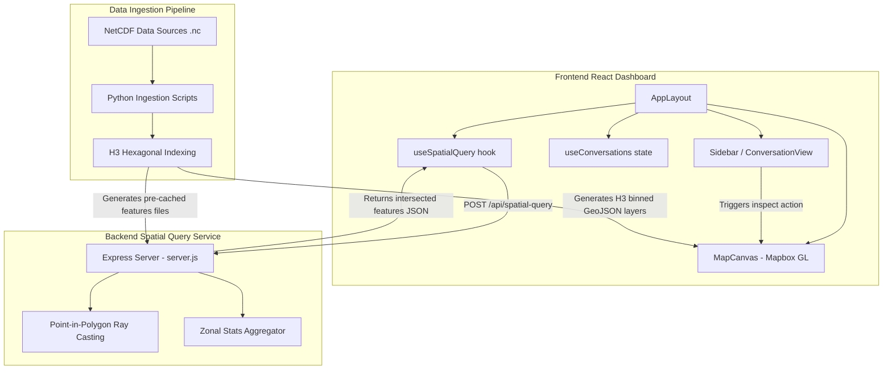

## Context

The PICT Climate Risk Visualizer and Chatbot is structured as a decoupled three-tier architecture:
1. **Frontend (Vite + React + Tailwind v4 + Mapbox GL)**: Provides the user dashboard. Renders a central map with Mapbox overlay layers and a chat-based sidebar that communicates with the AI and displays multi-step GIS analysis workflows.
2. **Backend (Node.js + Express)**: A lightweight spatial service that loads spatial database extracts (pre-processed GeoJSONs) and executes point-in-polygon centroid intersections (via ray-casting) to calculate zonal climate statistics.
3. **Data Ingestion Pipeline (Python + NetCDF + H3)**: Runs offline processing to downscale and ingest global/regional NetCDF climate files, bin them to H3 hierarchical hexagonal indexes, and export them as public-facing GeoJSON files for the client-side Mapbox layers.

## System Architecture Diagram

## Goals / Non-Goals

**Goals:**
- Formally document the baseline system components (Frontend, Backend, Ingestion Scripts) and their communication lines.
- Define how Mapbox GL, Turf.js/ray-casting centroid checks, and Python-based H3 binning process geospatial climate data.
- Standardize the custom event dispatcher contract (`workflow-complete`) that links chatbot workflow outcomes to Mapbox canvas updates.

**Non-Goals:**
- Replacing the Express backend with a real PostgreSQL/PostGIS server (out of scope for baseline spec).
- Replacing mock calculations inside frontend workflows with synchronous execution wrappers (addressed in downstream changes).

## Decisions

- **Ray-casting centroid check instead of full polygon intersection**:
  * *Rationale*: Performing full overlapping polygon intersections on large H3 hexagonal grids in pure Node.js is computationally heavy. Centroid checks (finding the center point of the H3 cell and verifying if it lies within the user's hand-drawn polygon) is extremely fast, performs at $O(N)$ complexity, and fits the single-threaded Node model perfectly.
- **H3 Indexing for NetCDF datasets**:
  * *Rationale*: Storing raw continuous grids is inefficient. H3 indexing discretizes spatial variables into regular hexagons, enabling quick lookup and seamless client-side Mapbox choropleth renders.

## Risks / Trade-offs

- **[Risk] Heavy client-side loading of GeoJSON datasets** $\rightarrow$ *Mitigation*: NetCDF coordinates are pre-binned to low H3 resolutions (Level 5/6) to keep GeoJSON file sizes under $5\text{MB}$, ensuring fast loads inside the browser.
- **[Risk] Anti-meridian crossing queries** $\rightarrow$ *Mitigation*: The current ray-casting algorithm operates on Cartesian coordinates. Points close to the $180^\circ$ longitude line may require normalization/wrapping logic in future analytical upgrades.
