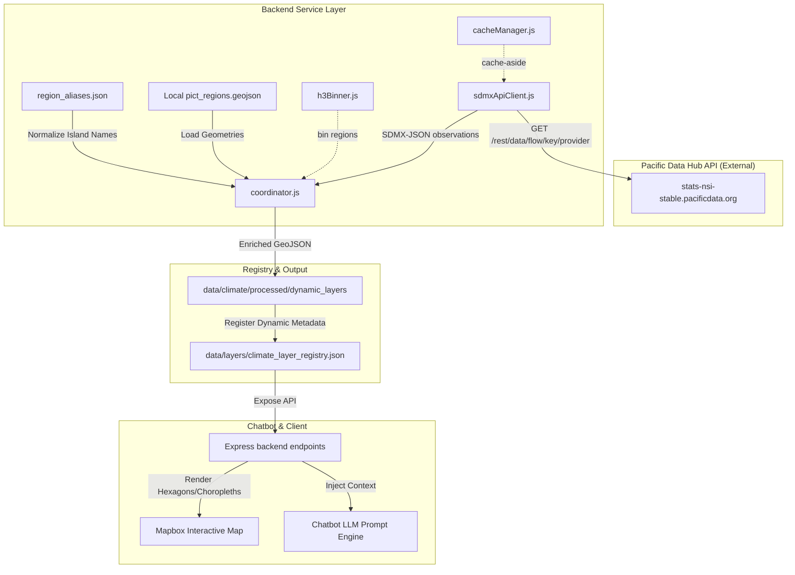

## Context

The Climate Risk A.I. chatbot and visualization map currently rely on mocked layer data and static temperature datasets. To support exposure sampling, risk indexing, and real spatial query validation, we need to integrate three real, decision-relevant datasets from the PICT DataViz Challenge:
1. **Sea Level Anomalies (Hazard)**
2. **Power Generation Infrastructure (Exposure)**
3. **Safely Managed Drinking Water Access (Vulnerability)**

Rather than storing raw datasets locally (e.g., large NetCDF files), we will fetch them dynamically using the Pacific Data Hub SDMX REST API (`https://stats-nsi-stable.pacificdata.org/rest/data/{flow}/{key}/{provider}`). The path uses composite `flow` IDs of the form `SPC,DF_*,*.*` (agency, dataflow ID, version) joined by commas, while `key` encodes the dimension series with `.` separators and `..` wildcards (e.g. `A.SH_H2O_SAFE...._T.....`). Since the API returns tabular indicators per year per island (rather than rich geospatial coordinates/shapes), the backend must fetch this data and join it with local regional boundaries (`data/reference/pict_regions.geojson`) using the ISO 2-letter region codes (e.g., `FJ` for Fiji, `TO` for Tonga).

The three layers map to the following requests:

| Layer | Flow | Key | Notes |
| --- | --- | --- | --- |
| Sea Level Anomalies | `SPC,DF_CLIMATE_CHANGE,1.0` | `A.SEA_LVL.` | `SEA_LVL` indicator; rest of dims wildcarded |
| Power Generation | `SPC,DF_POWER_GEN,1.0` | `A...` | All dimension slots wildcarded |
| Safely Managed Water | `SPC,DF_SDG_06,3.0` | `A.SH_H2O_SAFE...._T.....` | Indicator and SEX pinned, others wildcarded |

## System Architecture Diagram



## Goals / Non-Goals

**Goals:**
* **SDMX API Integration**: Connect backend services to the Pacific Data Hub REST API to retrieve Sea Level, Power Generation, and Drinking Water Access indicators.
* **Geospatial Boundary Joining**: Map tabular country/island observations (linked via `GEO_PICT` dimension, e.g. `FJ` or `KI`) to spatial geometries defined in `pict_regions.geojson`.
* **Dynamic Registration**: Adapt `data/layers/climate_layer_registry.json` to handle dynamically fetched/joined layers instead of static file configurations.
* **Data Processing & Caching**: Cache fetched API responses locally in the backend to ensure fast loading times (under 500ms) for Mapbox and Chatbot prompt context.

**Non-Goals:**
* **Real-time Spatial Interpolation**: We will not run live spatial interpolation models on the backend; regional/island-level indicators will map directly to the corresponding administrative/atoll polygons.
* **Database Ingestion**: We will not ingest API responses into a Postgres/PostGIS database; in-memory or file-based caching of JSON payloads is sufficient for these annual aggregates.

## Decisions

### 1. Fetching via SDMX-JSON Format
* **Decision**: Fetch data using SDMX-JSON only:
  - `Accept: application/vnd.sdmx.data+json;version=2.1`
  - `dimensionAtObservation=AllDimensions` (flat observation list, easiest to iterate)
  - `detail=dataonly` (drop attribute metadata we don't need)
* **Rationale**: SDMX-JSON contains structured dimensions (`GEO_PICT`, `TIME_PERIOD`) that map directly to region codes in `pict_regions.geojson` without heavy XML parsing. CSV is lighter but loses dimension metadata, making joins fragile.
* **Alternatives Considered**:
  - *SDMX-XML*: Bulky and harder to parse efficiently.
  - *SDMX-CSV*: Loses dimension metadata needed for the join.

### 2. Region Joining via ISO Codes (`GEO_PICT` to `pict_regions.geojson` properties)
* **Decision**: Align incoming API observations using the two-letter ISO country codes (e.g. `GEO_PICT="FJ"`) with matching attributes in `pict_regions.geojson` (e.g. `iso_3166_2`). If matching atoll-level data, fallback to normalizing name strings via `region_aliases.json` (confirmed to exist at `data/reference/region_aliases.json`).
* **Rationale**: Naming conventions can vary between datasets, but standard ISO codes are consistent and prevent join mismatches.

### 3. H3 Binning for Dynamic Island Layers
* **Decision**: For the Sea Level Anomalies layer (which requires H3 representation), we will generate H3 grids over country polygons during cache initialization, assigning the same regional value to all cells within the boundary. Use **Resolution 4** by default (~1,200 km² cells); fall back to Res 5 for atolls whose bounding box is smaller than one Res 4 cell, so islands like Tuvalu, Nauru, and Kiribati atolls are not dropped.
* **Rationale**: Res 3 cells average ~13,000 km² and would swallow small PICT atolls. Res 4 keeps visual consistency with other gridded hazard layers while preserving small islands.
* **Alternatives Considered**:
  - *Resolution 3*: Coarser and lighter, but loses small-island fidelity.
  - *Choropleth overlay*: Simplest, but loses visual consistency with other grid overlays. The architecture allows either, prioritizing consistent H3 representation if feasible.

## Risks / Trade-offs

* **Risk**: API downtime or network latency could cause visual layers to fail to load or block the chatbot.
  - **Mitigation**: Implement local backend caching. If the API call fails or is slow, the backend will return the latest cached JSON response from the disk/memory.
* **Risk**: Some remote islands or small atolls might not have matching observations in the API datasets.
  - **Mitigation**: Implement clear fallbacks in the join coordinator; missing areas will be assigned null/placeholder values and Mapbox will render them as unshaded polygons.

## Caching Strategy

* **Cache key**: `flow` + `key` (e.g. `SPC,DF_CLIMATE_CHANGE,1.0|A.SEA_LVL.`).
* **Location**: Disk under `data/cache/sdmx/<url-safe-cache-key>.json`; keep last payload in memory for sub-ms access.
* **TTL**: 24 hours. Data is annual aggregates; updates are rare. A monthly background refresh is also acceptable if the chatbot reads stale-tolerant values.
* **Refresh triggers**: (a) explicit admin/CI endpoint `POST /api/refresh?layer=...`, (b) TTL expiry on next read, (c) on-disk fallback only when PDH returns non-2xx or times out (≥10s — `backend/services/sdmxApiClient.js:95` uses `timeoutMs=10000`).

## Error-Handling Contract

The Express layer returns a consistent shape when PDH is unreachable and no cache exists:

```json
{ "layer": "sea_level", "status": "unavailable", "data": null, "error": "PDH unreachable, no cache" }
```

HTTP `503` if uncached and unreachable, `200` with stale payload otherwise. The chatbot prompt engine treats `status: "unavailable"` as a degraded-mode signal and avoids making quantitative claims about that layer.