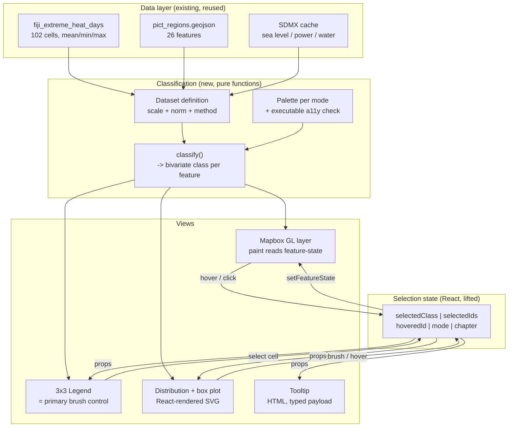

## Context

This change replaces the superseded `pacific-climate-brushing-viz` work, archived at
`openspec/changes/archive/2026-07-30-pacific-climate-brushing-viz/` and on branch
`feature/pacific-climate-brushing-viz` (tag `v0-brushing-viz-archive`). That change ended
with 13 DOM-level tests passing and 3 map-state tests failing, on a map whose thematic
layers were registered but never made visible.

Current branch state, verified 2026-07-30:

- `frontend/src/components/map/MapCanvas.tsx` — 2581 lines. **Any plan citing line
  numbers above this is describing the archived branch.**
- `backend/server.js` — 4876 lines. No CHVA route on this branch.
- `frontend/src/components/story/` — does not exist.
- `frontend/package.json` — no `d3`, no `zustand`, **no `typescript`**.
- `backend/services/h3Binner.js` — has the antimeridian wrap; does **not** have the
  land-mask filter (that lives in `5cd3c20`).
- `backend/tools/geospatial/` — 13 schema'd Python tools plus 19 pytest files. Untouched
  by this change and fully intact.

Data verified present (`docs/v2-direction-research.md` §3a):

| Dataset | Units | Notes |
| :--- | :--- | :--- |
| `data/climate/processed/fiji_extreme_heat_days_2050s_ssp245_access_cm2.geojson` | 102 cells | `_mean` / `_min` / `_max`; **single period, single model** |
| `data/reference/pict_regions.geojson` | 26 | `region_group`, `subregion`, `iso3` |
| `data/reference/fiji_tikina.geojson` | 86 | Province / Division / Tikina |
| SDMX cache | country level | sea level anomaly, power gen, water access |

**Population exists only at country level** — `POP_EST` / `POP_YEAR` on
`data/reference/_ne_10m_admin_0_map_units.geojson`, 30 Pacific-subregion features, 2019,
joined on ISO3 (GitHub issue #11). **No multi-year climate time series exists** (issue
#9). Both were verified directly, and both constrain scope.

## System Architecture Diagram

The asymmetry is deliberate: **every view reads selection state as React props, and only
the map has an imperative write path** (`setFeatureState`). That is the one place GPU
state cannot be expressed declaratively.

## Goals / Non-Goals

**Goals:**

- Ship a reviewable prototype by ~2026-08-06 using only data already on disk.
- Build the three bivariate modes named in the lab notes, with the legend as the primary
  brush control.
- Establish a chart architecture in which the v1 self-destruction defect cannot occur.
- Make map state — not React state — the thing tests assert against.
- Produce a container that a later emerging-hotspot or uncertainty direction can slot
  into without rework.

**Non-Goals:**

- Emerging hotspot analysis, Getis-Ord Gi\*, Mann-Kendall, space-time cubes. Blocked on
  data; see Decision 6.
- Tuberculosis linkage and Nightingale rose charts. Blocked on the same open question.
- Any synthetic or generated health data. Prohibited outright; see Decision 7.
- Sub-national population and population time series — neither exists (issue #11).
  Country-scale population is in scope.
- Replacing the chatbot API, `/api/spatial-query`, or the Python geospatial tool registry.
- Migrating away from Mapbox GL to `d3-geo` projections. Considered and rejected; see
  Decision 5.

## Decisions

### Decision 1: React renders every chart mark; D3 computes only

Adopt `d3-scale`, `d3-shape`, `d3-array` for scales, arc/line generators, and binning.
**Do not install `d3-selection` or `d3-brush`.** Charts receive `width`/`height` as props,
build scales in `useMemo`, and return marks from `data.map(...)`.

- **Rationale.** v1's worst defect was an effect calling `svg.selectAll("*").remove()`
  while listing interaction state in its dependency array — hovering deleted the element
  under the cursor. That defect *requires* imperative D3 DOM ownership to exist. Removing
  it retires the entire bug class rather than avoiding it. Evidence:
  `docs/v2-reference-implementations.md` §2 — the winning Pacific Data Challenge entry's
  `src/` tree contains **zero** uses of `d3-selection`, `d3-brush`, `selectAll`, or an
  SVG ref, and it depends only on `d3-array`, `d3-scale`, `d3-shape`, `d3-geo`.
- **Alternative considered.** Keep `d3-selection` and apply the retrospective's
  split-effect rule (build effect on stable deps, restyle effect on interaction state).
  Rejected: it is a discipline that must be re-applied correctly in every component, and
  the externally-supplied v2 plan reproduced the exact bug in its rose chart, which
  demonstrates how readily the discipline lapses.
- **Consequence.** Brushing must be implemented as a React-owned drag rectangle rather
  than `d3.brush()`. More code, but it lives in the same render tree and cannot be
  clobbered by a re-render.

### Decision 2: Selection state is lifted React state, with no source attribution

A single owner component holds `mode`, `selectedClass`, `selectedIds`, `hoveredId`, and
`activeChapter`, passing them down as props.

- **Rationale.** v1 built `useBrushingState` with a `source: "MAP" | "CHART" | "STORY"`
  field to prevent feedback loops. The retrospective records that **nothing ever read
  `source`** and the loop never materialised. The reference implementation does
  cross-chart linking with a prop and an opacity ternary and no store at all.
- **Alternative considered.** Zustand. Rejected: not currently a dependency, and the
  externally-supplied plan named it as though it were already in use, which it is not.
- **Guard.** If a genuine loop appears, add attribution then, with a regression test that
  demonstrates the loop first.

### Decision 3: Map layers register on `style.load`, and setup is idempotent

- **Rationale.** `load` waits for the style *and* the initial tile set. In v1 a stalled
  tile meant the entire setup callback never ran, so **no** custom source or layer was
  ever added — verified across `chva-facilities`, `climate-temp`, `sea-level-h3`, and
  `power-gen-fill` simultaneously, with zero exceptions thrown.
- **Detail.** Use `if (map.isStyleLoaded()) setup(); else map.once("style.load", setup);`
  with a `layersInitialized` guard. This shape is already proven on the archived branch
  (commit `b92169a`) and is being carried forward, not reinvented.

### Decision 4: Bivariate classification is a pure function over a declared dataset definition

Each dataset declares its geographic scale, its two variables, each variable's
classification method, and — for `diverging-diverging` — an explicit norm value.
Classification runs once and attaches a class index to each feature.

- **Rationale.** Three separate failure modes are closed by this. A norm derived at render
  time from the visible extent would silently change meaning as the viewport moves. A
  bivariate pairing across scales (102 Fiji cells against 26 PICT countries) is
  incoherent and must fail loudly at load rather than produce a plausible-looking map.
  And exposing the break values to the legend is what makes the encoding readable rather
  than decorative.
- **Alternative considered.** Compute breaks per viewport for maximum contrast. Rejected —
  it makes two screenshots of the same data non-comparable.

### Decision 5: Keep Mapbox GL; do not migrate to `d3-geo` SVG

- **Rationale.** The reference entry renders its map as projected SVG via `d3-geo`, which
  makes map↔chart linking nearly free because both live in one React tree and one
  coordinate system. It is genuinely attractive. But we have substantial Mapbox-specific
  investment: H3 binning, centroid-relative antimeridian wrapping, the land mask, and
  `feature-state` paint. Migrating strands all of it.
- **Trade-off accepted.** The map keeps an imperative write path that the charts do not.
  This is the single asymmetry in the architecture and it is confined to one effect.

### Decision 6: Emerging hotspot analysis is out of scope for this change

- **Rationale.** Two independent blockers, both verified. (a) Getis-Ord Gi\* over ~20
  ocean-separated PICTs has no defensible spatial weights matrix and little power after
  the FDR correction the method applies — the lab notes themselves record "we're limited
  by granularity of data which is on the country level". (b) The heat layer is a
  **single period** projection (2050s, SSP2-4.5, ACCESS-CM2), so no space-time cube can
  be constructed from it at all.
- **Path back in.** 86-tikina geometry exists and is the right analytical unit. When
  multi-year layers are produced through `backend/scripts/build_climate_layer_from_nex.py`, an EHSA layer
  becomes just another encoding inside this change's frame — which is the main reason to
  build the frame first. Implement Gi\* via `esda`/`libpysal` or the student's notebook,
  and include Mann-Kendall; without it, Intensifying / Persistent / Diminishing cannot be
  distinguished. Note the full ESRI taxonomy is **16 categories**, not the three in the
  notes.

### Decision 7: No synthetic health data, under any labelling

- **Rationale.** The externally-supplied plan proposed a "synthetic time-series generator
  for tuberculosis/health indicator trends across Pacific territories," feeding an
  analysis labelled with real ESRI category names. A map reading "persistent tuberculosis
  hotspot" over a real territory, computed from generated numbers, is indefensible in a
  lab meeting, a competition submission, or a publication — the visual claim outruns any
  caveat, and it risks the project's standing with SPC/PDH as data providers.
- **Permitted narrowly.** Clearly-labelled fixtures for performance testing or interaction
  development, never rendered as analysis and never shipped in a reviewable build.

### Decision 8: Install `typescript` and type-check in CI

- **Rationale.** `npm run build` uses esbuild and does **not** type-check. v1 widened a
  union type that nothing ever verified. `npm run lint` catches some of this, not all.
  One devDependency plus one script closes the gap.

## Risks / Trade-offs

- **[Risk] The prototype deadline is ~1 week and the palette work is the long pole.**
  Building three defensible 3×3 palettes with an executable accessibility check is more
  work than it appears. → *Mitigation:* land `sequential-sequential` first with the
  heat × uncertainty pair (which v1 already prototyped as "Heat Hazard × Climate
  Uncertainty"), then add the other two modes. One working mode is a reviewable
  prototype; three half-working modes are not.

- **[Risk] React-rendered brushing is more code than `d3.brush()`.** → *Mitigation:* the
  legend is the primary selection control per the lab notes, so chart brushing is
  secondary and can ship after the legend. If it slips, the core interaction still works.

- **[Risk] The Fiji grid and the PICT indicators cannot appear in one bivariate map.**
  → *Mitigation:* treat scale as a chapter property — Pacific-wide chapters use
  country-level pairs, Fiji chapters use the 102-cell grid. Decision 4 makes a
  mixed-scale definition fail loudly rather than silently.

- **[Risk] Mapbox rejects `["zoom"]` nested inside `case`,** throwing during `addLayer`
  and **silently aborting every layer registered after it** — a blank map with one
  console line and no build failure. Cost roughly one test cycle in v1. → *Mitigation:*
  keep `interpolate` outermost with `case` inside each zoom stop; register layers so one
  failure cannot cascade; assert every declared source exists after style load.

- **[Trade-off] Dropping `d3-brush` costs a well-tested library.** Accepted: the library
  was not the problem in v1 — its interaction with React's lifecycle was.

- **[Trade-off] This change ships design and encoding depth, not analytical novelty.**
  Accepted deliberately as a scheduling decision. Directions A and C both stall on data
  acquisition; this one does not, and it is the container they later occupy.

## Open Questions

1. **Does tuberculosis data exist below national level, and at what time depth?** This is
   the single question that decides v2's analytical contribution. If it is one value per
   country per year, every Fiji tikina shares that value and "click a province → see TB
   change" has nothing to drive. Answerable in a day; should run in parallel with this
   change.
2. **How many hotspot categories would we ever show?** Eight-plus categorical classes is a
   hard color problem, and the lab notes insist color must carry a message. Collapsing to
   4–5 is likely better and is an analytical choice, not a design one.
3. **Fiji or all PICTs as the headline scope?** The statistics push toward Fiji; the
   competition framing and the PDH indicators push regional.
4. **Is this targeting the Pacific Dataviz Challenge, or lab research output first?** The
   PI redirect suggests research now leads, which changes what "done" means.
5. **Which classification method per variable** — quantile, equal interval, or natural
   breaks? Decision 4 requires it be declared; it does not yet say which.
