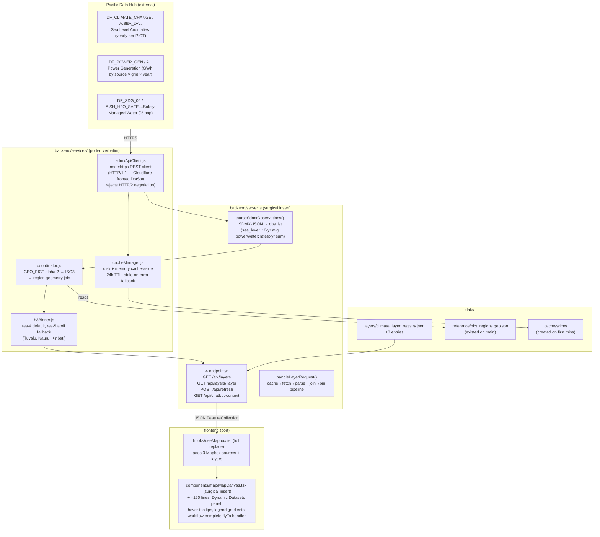

## Context

The `feature/integrate-starter-bundle` branch (tip `a94d41d`) carries a working SDMX-to-Mapbox pipeline that fetches three indicator datasets from the Pacific Data Hub (`stats-sdmx-disseminate.pacificdata.org`), joins them to PICT region geometries, and renders them as live map layers. This pipeline must be re-integrated onto the current `main` (tip `6e0eb81`), which has diverged substantially — particularly in `backend/server.js` (4,459 lines, god file) and `frontend/src/components/map/MapCanvas.tsx` (2,373 lines, admin/heat-risk rewrite).

This change targets a clean, surgical port of the SDMX pipeline without touching main's existing endpoint behavior or its PICT admin/heat-risk UI. The chat-mock layer and workflow viewer demo are explicitly out of scope (gh issue #3, `visual-workflow-programmer` openspec change).

The merge-base was `471b732`. Main's `useMapbox.ts` is unchanged since merge-base; main's `climate_layer_registry.json` and `thematicMapConfigs.ts` likely identical to merge-base too. This means the feature branch's modules can largely land as-is, with surgical inserts in only `server.js` and `MapCanvas.tsx`.

## System Architecture Diagram

## Goals / Non-Goals

**Goals:**
- Preserve the fetch-on-request-with-stale-fallback operational model — correct for an external read-mostly API behind an unreliable upstream.
- Land the SDMX pipeline as a coherent unit without entangling it with unrelated feature-branch work (chat mocks, workflow viewer) that belongs in other changes.
- Add a pure-function pytest unit test for `parseSdmxObservations` matching main's `backend/tests/test_*.py` fixture convention — addresses the gap that both branches currently only test at the HTTP/integration tier for JS-layer code.
- Keep main's PICT admin/heat-risk UI untouched in `MapCanvas.tsx`.
- Keep main's `server.js` behavior untouched for all existing endpoints; only add the 4 new SDMX endpoints and 2 helper functions.

**Non-Goals:**
- Refactor `server.js` into domain modules (tracked separately by gh issue #2 — the god-file debt is acknowledged; this change avoids the refactor to keep diff surface small).
- Migrate SDMX services from JS to Python's `tools/geospatial/` package. Main's Python toolkit is batch/CLI infrastructure (no request-time bridge exists today); adding a JS↔Python bridge would be a larger architectural commitment than this change warrants.
- Any chatbot response rewrite (gh issue #3).
- Any aspect of `visual-workflow-programmer` (separate openspec change).
- TypeScript migration of SDMX services or `useMapbox.ts`.
- NetCDF reprocessing or changes to `data/climate/raw/`.

## Decisions

### 1. Keep SDMX pipeline in JS services (option 1 of three explored)

**Decision:** Port `backend/services/{sdmxApiClient,cacheManager,coordinator,h3Binner}.js` verbatim. Add the 4 endpoints and 2 helpers surgically to `server.js`.

**Alternatives considered:**
- **Rewrite as Python `tools/geospatial/indicators.py` module.** Main's `tools/geospatial/` package is well-tested (~80% test-to-code ratio) but it's batch/CLI infrastructure that `server.js` does not call at request time. A JS↔Python bridge (subprocess or Flask/FastAPI sidecar) would be a new runtime component that main doesn't have. Cost > benefit for one indicator pipeline.
- **Hybrid: JS services + Python warm-cache script.** Operational complexity grows; two cache layers if cosmetic. Defer until traffic/latency data justifies it.

**Rationale:** The JS-services pattern matches the existing working wiring. The operational model (fetch-on-request with disk-backed stale fallback) is correct for this external API. Both branches have the same gap on the JS tier of untested side-effect-heavy code; introducing a new bridge pattern in this change would expand blast radius without addressing the underlying debt (gh issue #2 will).

### 2. Helpers `parseSdmxObservations` and `handleLayerRequest` live in `server.js` with conditional startup

**Decision:** Inline the two helpers into the surgically-modified `server.js` rather than creating a new `services/sdmxPipeline.js` module. Wrap all startup code (data loading, console.log statements) in a `startServer()` function that only executes when the module is run directly. Export `parseSdmxObservations` for testing.

**Rationale:** The explore agent's port plan proposed this. The 4 service modules (`sdmxApiClient.js` through `h3Binner.js`) are clean, single-concern units that are easy to test in isolation. The remaining orchestration (`parseSdmxObservations` + `handleLayerRequest`) needs to coordinate cache + fetch + parse + join + bin across those modules and is more naturally cohesive with the route handlers. Extracting it now would create a 5th module whose API surface is unclear; gh issue #2's `server.js` refactor is the right venue.

**Implementation:** To enable testing without triggering startup output, the data loading and console.log statements were moved into a `startServer()` function. A conditional check (`if (import.meta.url === \`file://${process.argv[1]}\`)`) ensures `startServer()` only runs when the module is executed directly. The `parseSdmxObservations` function is exported for test imports.

### 3. `useMapbox.ts` full replacement, `MapCanvas.tsx` surgical insert

**Decision:** Replace `frontend/src/hooks/useMapbox.ts` entirely with the feature branch version. Add only the "Dynamic Datasets" panel section + tooltip handler + flyTo listener + legend blocks to main's `frontend/src/components/map/MapCanvas.tsx`.

**Rationale:** Main's `useMapbox.ts` is identical to the merge-base version. The feature branch version adds 3 sources/layers + a fetch-on-load effect. There is no main-specific work to preserve in this file. Conversely, main's `MapCanvas.tsx` is a 2,373-line PICT admin/heat-risk rewrite — replacing it would discard significant work. The LD（LOW-RISK）surgical insert approach keeps main's UI intact.

### 4. `ClimateLayer` and main's `MapLayer` type systems independently coherent

**Decision:** Let `useMapbox.ts`'s `ClimateLayer` union widen to `"tas" | "wet_bulb" | "sea_level" | "power_gen" | "water_access" | null`. Add the same 3 dynamic values to main's `MapLayer` type union in `MapCanvas.tsx`. Do not unify the two type aliases in this change.

**Rationale:** The two unions have separate histories and serve separate scopes (`useMapbox` is the lower-level layer-state hook; `MapCanvas` adds its own `"manual_heat_risk"` that `useMapbox` knows nothing about). Forcing one shared type would require a wider refactor; keeping them coherent by-value is sufficient and matches how both files already treat the union independently.

### 5. Unit-test `parseSdmxObservations` with mock SDMX-JSON payloads as inline fixtures

**Decision:** The new pytest file `test_parse_sdmx_observations.py` uses inline Python dicts as mock SDMX-JSON payloads (not external JSON files), following the inline-fixture pattern in main's existing `tests/test_*.py` modules.

**Rationale:** Main doesn't have a shared fixture library — each test file constructs small synthetic GeoJSON/SDMX-JSON inline (e.g., `test_sample_hazard_at_assets.py::make_hazard_artifact`). Matching this convention is what "tests follow the right schema" means concretely. External fixture files would introduce a new convention this codebase doesn't use.

### 6. Integration tests stay in pytest over HTTP (no port to Node test runner)

**Decision:** Ported test files (`test_spc_api_client.py`, etc.) keep using `requests` against a spawned server. They are not migrated to Vitest/Supertest.

**Rationale:** Main's JS layer has zero tests today (server.js itself is untested). The Python→HTTP integration test pattern is already proven for the feature branch and uses tooling that main already has (`pytest`). Migrating to a JS-side test runner would add infrastructure larger than the change itself. If gh issue #2 emerges with a Node test runner, integration tests can be migrated then.

## Risks / Trade-offs

- **Risk:** Manual edits to main's 4,459-line `server.js` introduce a syntax/binding error that breaks the existing 6 endpoints. → **Mitigation:** Use `node --check backend/server.js` before starting the server. Add a smoke test (curl all 6 of main's existing endpoints + the 4 new ones) before declaring the commit done. Order this commit after the verbatim backend service files (Commit 1) and before the frontend port (Commit 6) so breakage surfaces fast.

- **Risk:** `parseSdmxObservations` has layer-specific branches (10-year average only runs for `sea_level`; power_gen and water_access use latest-year sum). Inline mocking requires constructing valid SDMX-JSON for each path. → **Mitigation:** Construct one compact fixture per layer type in the unit test (≤ 30 lines each); assert exact observation tuples. This is what main's `test_*` files do for their function inputs.

- **Risk:** `MapCanvas.tsx` surgical insert breaks main's admin boundary UI (state sharing, prop drilling, layer rendering order). → **Mitigation:** Insert in a distinct JSX region (the layer selector panel) after main's existing climate-projection buttons. Do not modify shared `activeLayer` state semantics — only add new branches that the existing render logic doesn't reach. Run Playwright e2e for spatial-query (`spatial-query.spec.ts`) after the insert to verify main's UI still passes.

- **Risk:** `useMapbox.ts` replacement changes the return shape that main's `MapCanvas.tsx` destructures. → **Mitigation:** Diff main's and feature's `useMapbox` return signatures before commit. Main's MapCanvas destructures `{ mapboxMap, mapContainerRef, activeLayer, setActiveLayer, showGlobalDataset, setShowGlobalDataset }` — confirm the feature-branch version returns these + nothing absent. If main's version returns something the feature's doesn't (e.g., a heatmap field added on main), preserve it in the replacement.

- **Risk:** Pacific Data Hub goes down at test time and integration tests fail spuriously. → **Mitigation:** Integration tests already accept both `status: 200 (available|stale)` and `status: 503 (unavailable)` assertions. Unit tests for `parseSdmxObservations` are pure (no network). Tests pass against any live or downed PDH state.

- **Trade-off:** Carrying ~150 lines of additional god-file debt in `server.js`. Each commit makes this file worse until gh issue #2 lands. **Acceptable** — alternative would be extracting `server.js` first (large risk to main's currently-working endpoints) or landing SDMX and refactor in one mega-PR (poor reviewability).

- **Trade-off:** The 4 ported HTTP integration tests require a spawned Express server to run. CI for this is not set up today (no `.github/workflows/ci.yml`). Tests run locally only for now. **Acceptable** — adding a CI workflow is out of scope; main's existing pytest suite also runs locally without CI today.

## Open Questions

- Should the 4 SDMX endpoints live at `/api/layers/*` (namespaced with the dynamic-layer concern) or under a `/api/sdmx/*` path to make the upstream dependency explicit? **Default:** keep `/api/layers/*` to match the existing wiring in `useMapbox.ts` and avoid a frontend rewrite. **Revisit:** when gh issue #2 lands and routes are reorganized.
- The `workflow-complete` flyTo event listener in `MapCanvas.tsx` is preserved for forward-compat with `visual-workflow-programmer`, but the `workflow-complete` event is currently only dispatched by mock chat code — which gh issue #3 will remove. After issue #3 lands and before `visual-workflow-programmer` lands, the listener is dead code. **Default:** preserve anyway (it's <15 lines, harmless, and signals intent). **Revisit:** if it causes confusion during code review.