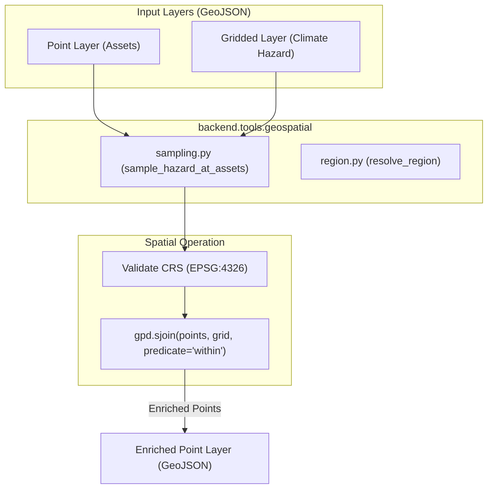

## Context

The Python backend geospatial package (`backend/tools/geospatial/`) provides functions for chatbot pipelines. To support point-level exposure checks (e.g., looking up projected temperatures at specific hospital locations), we will introduce a new module `sampling.py` containing the `sample_hazard_at_assets` wrapper.

## System Architecture Diagram

## Goals / Non-Goals

**Goals:**
- Implement `sample_hazard_at_assets` in Python utilizing `geopandas.sjoin` for spatial overlays.
- Standardise inputs: both `points_layer` and `raster_layer` must be GeoJSON dictionaries representing FeatureCollections.
- Ensure automated coordinate reference system (CRS) alignment to EPSG:4326.
- Write robust unit tests validating overlapping features and correct attribute extraction.

**Non-Goals:**
- Directly reading binary NetCDF (`.nc`) or GeoTIFF files within the function; the gridded layer must be loaded first as a GeoJSON FeatureCollection (e.g. by `load_climate_projection`).
- Modifying Express `server.js` route configurations or UI widgets.

## Decisions

### 1. Ray-Casting Spatial Join (gpd.sjoin) over H3 Binning
**Decision:** Implement point-in-polygon overlay using `geopandas` spatial join (`gpd.sjoin(predicate="within")`) rather than converting point coordinates to H3 index IDs in Python.
**Rationale:** The gridded hazard datasets might not always be represented as H3 hexagons (e.g. they could be rectangular netCDF grid polygons or admin districts). Spatial joins are geometry-agnostic and work with any polygon boundaries.

### 2. Standardized Output Payload Structure
**Decision:** Return a standardized dictionary payload containing:
- `artifact_type: "sampled_points"`
- `geojson: {...}` (the enriched FeatureCollection)
- `feature_count: int`
- `warnings: list[str]`
**Rationale:** Consistency with other wrappers (`resolve_region`, `load_climate_projection`) allows the frontend and workflow engine to chain steps together seamlessly.

## Risks / Trade-offs

- **Risk:** High-resolution points layers might be joined with low-resolution grids, leading to multiple points matching the same grid cell value.
- **Mitigation:** This is expected behavior for gridded climate projections. The function will document this in its provenance metadata.
- **Risk:** Points located outside the spatial extent of the grid will receive null hazard values.
- **Mitigation:** The system will populate warnings list indicating how many points were not matched to any cell.
