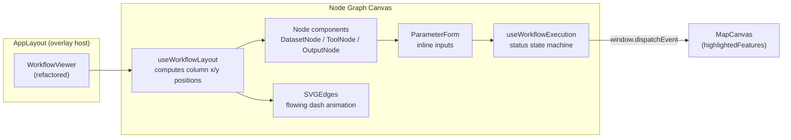
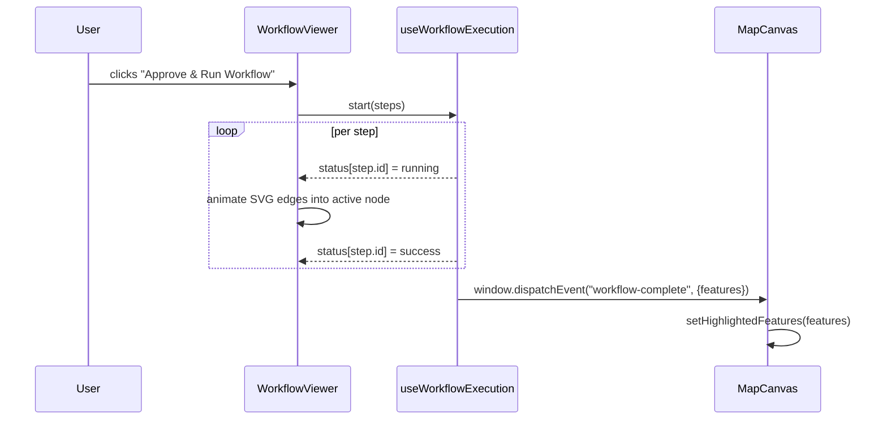

## Context

The current `WorkflowViewer` (`frontend/src/components/chat/WorkflowViewer.tsx`) renders a chatbot-suggested GIS pipeline as a vertical accordion list of step cards. Each `WorkflowStep` exposes inputs, outputs, tool name, data source, uncertainty and diagnostics. Execution is mock-simulated through nested `setTimeout` calls and final results are dispatched to the Mapbox canvas via a `workflow-complete` `CustomEvent` consumed in `AppLayout` (`frontend/src/components/layout/AppLayout.tsx:57`).

The list layout makes it hard to visually grasp spatial dependencies between dataset inputs, analytical tools and map outputs. Parameter edits live only inside expanded step bodies and there is no representation of data flow between steps. The proposal replaces the accordion with an interactive node-and-edge graph while preserving the existing `WorkflowData`/`WorkflowStep` contract, the mock execution model, and the `workflow-complete` event contract consumed by `AppLayout`.

Constraints:
- Pure React + Tailwind v4. No new heavy external graph rendering packages (e.g. React Flow, D3) are introduced by this change.
- The viewer remains mounted as an overlay popup on top of `MapCanvas` (currently `w-[340px]`, see `AppLayout.tsx:95`) - the overlay width must expand to accommodate a horizontal flow canvas.
- `useConversations.js` is the persistence layer; it does not currently understand per-step parameter edits, so this change must not break its existing serialization shape.

## System Architecture Diagram

## Goals / Non-Goals

**Goals:**
- Render pipeline steps as a left-to-right column-based node graph (Dataset Inputs → Analytical Tools → Map Outputs) computed deterministically from the existing `WorkflowStep[]`.
- Draw SVG edges connecting a step's `outputs` to the next step's matching `inputs[*]` keys, with flowing dash-array animations only on edges feeding a `running` node.
- Allow inline editing of numeric and `expression` parameter fields on Tool nodes, mutating the active workflow state before execution.
- Map execution statuses (`pending` / `running` / `success` / `failed`) to node border glow and status badges, mirroring the current `getStatusIcon` behaviour.
- Preserve the existing `workflow-complete` CustomEvent contract so `AppLayout` and `MapCanvas` require no changes.

**Non-Goals:**
- Drag-and-drop node repositioning or manual graph editing (nodes are auto-laid-out from `WorkflowStep[]`).
- Real backend execution - the mock `setTimeout` pipeline stays in place.
- Persisting user parameter edits back to `useConversations.js` localStorage store.
- Introducing third-party graph libraries (React Flow, reactflow, D3, etc.).

## Decisions

### 1. Column-based deterministic layout over a force-directed graph
**Decision:** Compute node positions as columns (Dataset Inputs at x=0, each Tool step at successive x increments, Map Outputs at the final column). Vertically centre nodes within each column.
**Rationale:** GIS pipelines are linear/branching forward by nature; a column layout mirrors the dataflow semantics, is far cheaper to compute than a force-directed simulation, and avoids the visual jitter users would see with animated layouts. It also keeps the implementation dependency-free.
**Alternatives considered:**
- *React Flow / reactflow* - rejected: proposal explicitly forbids heavy external visual rendering packages.
- *Dagre* for layered layout - rejected: adds a dependency for a layout a ~40-line `useWorkflowLayout` hook can produce.

### 2. SVG edges drawn in a single full-canvas `<svg>` overlay
**Decision:** Render one absolutely-positioned full-size `<svg>` behind the node HTML layer and draw each edge as a cubic Bézier path between source-node output port and target-node input port.
**Rationale:** Keeps edges independent of node HTML structure, supports CSS dash-array animation via `stroke-dashoffset`, and stays inside the "pure React & Tailwind" constraint. Single SVG layer avoids creating N inline SVGs per edge.
**Alternatives considered:**
- *HTML/CSS borders/pseudo-elements* - rejected: cannot represent curved multi-port edges cleanly.
- *Canvas 2D drawing* - rejected: requires manual redraw lifecycle and loses CSS animation hooks.

### 3. Node typed as Dataset / Tool / Output derived from step position
**Decision:** Infer node kind from position in `steps[]`: the first step's source layer is a Dataset node, intermediate steps are Tool nodes, the final step's `outputs[0]` is rendered as a Map Output node.
**Rationale:** Existing `WorkflowStep` schema has no explicit `kind` field, and the proposal's three node types correspond cleanly to this positional mapping. Avoids changing the data contract.
**Alternatives considered:**
- *Extend `WorkflowStep` with a `kind` discriminator* - rejected: would require touching `useConversations.js` mock generator and the persisted shape.
- *Infer from `tool_name` substring* - rejected: brittle and locale-dependent.

### 4. Extract `useWorkflowExecution` hook from the existing inline state machine
**Decision:** Lift `executionState`, `currentStepIndex`, `stepStatuses` and the `startMockExecution` logic out of `WorkflowViewer` into a `useWorkflowExecution` hook in a new `frontend/src/components/chat/workflow/` folder.
**Rationale:** The nested `setTimeout` block is currently the single largest source of complexity (lines 50-149 of `WorkflowViewer.tsx`). Extracting it makes the graph renderer purely presentational and lets the tests target the state machine in isolation.
**Alternatives considered:**
- *Keep execution state inside `WorkflowViewer`* - rejected: produces an untestable 400+ line component.
- *Move to a global store (Zustand/Context)* - rejected: workflow execution is ephemeral per-overlay; the existing pattern already couples it to the viewer and `AppLayout`.

### 5. Parameter edits mutate a local `steps` state owned by the viewer
**Decision:** Keep the existing `useState<WorkflowStep[]>` pattern in `WorkflowViewer` (already present at line 26), but route mutations through the new hook so edges re-derive automatically when an `input_layer` reference changes.
**Rationale:** Maintains backward compatibility with how `useConversations.js` produces the payload (it emits the static object once and never reads back edits), so we don't have to touch the persistence layer. Matches the proposal's "Non-Goals" of persisting edits.
**Alternatives considered:**
- *Push edits into `useConversations.js`* - rejected: out of scope and would require a new message-type contract with the mock backend.

### 6. Overlay width expands to a larger fixed canvas
**Decision:** Change the `activeWorkflow` overlay in `AppLayout.tsx:95` from `w-[340px]` to a wider breakpoint-aware container (e.g. `w-[min(900px,90vw)]`) with horizontal pan/scroll inside the graph canvas.
**Rationale:** A node graph needs horizontal real estate that a 340px sidebar-style chrome cannot provide; restricting pan/scroll to the canvas (not the whole overlay) keeps the title and run controls pinned.
**Alternatives considered:**
- *Render the graph in a full-screen modal* - rejected: breaks the "popup overlay on top of MapCanvas" intent in the proposal.
- *Keep 340px and stack nodes vertically* - rejected: that is the current accordion layout.

## Risks / Trade-offs

- **[Risk] Overlay width expansion covers more of the MapCanvas** → Mitigation: pin the overlay to `top-4 right-4` as today, cap at `90vw` with `max-h-[calc(100%-2rem)]`, and keep `pointer-events` only on the overlay so the map below stays interactive.
- **[Risk] SVG edge endpoints drift if node heights vary** → Mitigation: compute port y-positions from rendered node refs via `ResizeObserver` inside `useWorkflowLayout`; fall back to the deterministic centre if refs are absent on first paint.
- **[Risk] Inline parameter form changes input layer name and breaks edge derivation** → Mitigation: edge derivation uses normalised layer-name matching (trim + lowercase) and drops an edge rather than throwing when an input cannot be resolved to a prior step's output.
- **[Risk] Mock execution timing accumulation drifts if user re-runs** → Mitigation: `useWorkflowExecution` clears any pending timers on `start()` and on unmount via a tracked `timeoutIds` array.
- **[Trade-off] Positional node typing fails for workflows that start with a raster input** → Accepted: the mock workflow generator always starts with a vector `select_features_by_attribute` step; extending typing is a follow-up change.
- **[Trade-off] No persistence of parameter edits** → Accepted per Non-Goals; a follow-up change can wire edits into `useConversations.js` when the real backend lands.