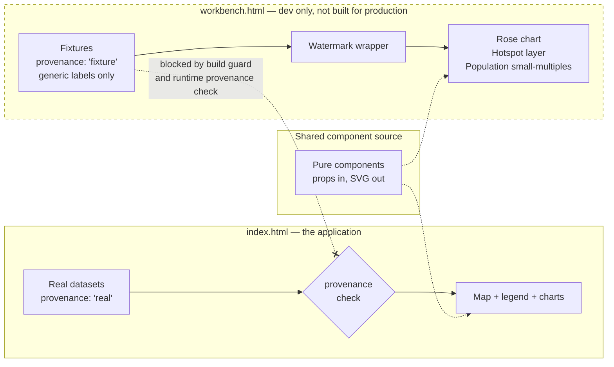

## Context

Three lab-note features are blocked on data acquisition tracked in GitHub issues #9
(multi-period heat layers), #10 (sub-national tuberculosis data) and #11 (official PDH
population). The components themselves are not blocked — they are pure functions of their
props.

Current frontend state, verified 2026-07-31 (`research.md` → Verified facts):
`frontend/vite.config.js` declares a **single entry** with no router and no `build` key at
all; the only HTML entry is `frontend/index.html`; scripts are `dev`, `build`, `typecheck`,
`lint`, `preview`, `test:e2e`, `test:e2e:spatial`, `test:palette`. There is no
component-explorer tooling and no fixture directory. `lint` already chains a bespoke node
guard (`scripts/guard-d3.mjs`), which is the pattern the new guards should follow.

One component that *appears* to belong here does not, though not for the reason first
recorded. The **uncertainty box plot is still out of scope**, but its data is not usable
either: `extreme_heat_days_min` / `_mean` / `_max` exist on all 102 cells in
`data/climate/processed/fiji_extreme_heat_days_2050s_ssp245_access_cm2.geojson` and every
one of them is `0`, so a box plot over them renders a flat line. The fields being present
was mistaken for the values being usable — see `research.md` → Superseded claims.

The usable real field in that file is `mean_tasmax_c_mean` (95 non-null of 102,
24.30–28.79 °C). So the box plot belongs in `pacific-bivariate-scrollytelling-viz` built
against *that*, or it waits on issue #8 for a region-appropriate heat threshold. Either
way it is not mocked here — but "its data is real" is no longer the reason.

## System Architecture Diagram

The components are shared; the **data paths are not**. Fixtures can reach the gallery and
nothing else, enforced twice — at build time by entry separation, and at runtime by the
provenance check.

## Goals / Non-Goals

**Goals:**

- Let blocked components be built, reviewed, and demonstrated now.
- Answer rendering questions that do not depend on real data — chiefly whether 5–8
  categorical classes are simultaneously legible.
- Make it structurally impossible for synthetic data to appear in the application.
- Give the next lab meeting a running artefact that strengthens the case for issues
  #9–#11.

**Non-Goals:**

- Any statistical computation. This change renders shapes.
- Promoting components into the application — that happens when real data lands.
- A component-explorer dependency (Storybook and similar). Unnecessary here.
- Mocking the uncertainty box plot. It stays out of this change, but see Context — its
  heat-days values are degenerate, so it is not the "real data already exists" case it was
  originally recorded as.

## Decisions

### Decision 1: A second Vite entry, not a route

Add `frontend/workbench.html` as a second entry via `build.rollupOptions.input`, and exclude it
from the production build.

- **Rationale.** Isolation should be structural rather than conditional. A route inside
  the application means fixture modules are in the same module graph as production code
  and are one import away from being pulled in — the guard would be a lint rule and a
  convention. A separate entry means the production bundle *cannot* contain them, and
  that is assertable.
- **Alternative considered.** A `/workbench` route behind an environment flag. Rejected:
  flags get flipped, and the failure is silent.
- **Alternative considered.** Storybook. Rejected: a substantial dependency and
  configuration surface for what is one HTML file and a list of components.

### Decision 2: Provenance is a required field with no default

Every dataset carries `provenance: "real" | "fixture"`, required.

- **Rationale.** A default of `"real"` means forgetting the field silently produces the
  dangerous state. A default of `"fixture"` means forgetting it silently blocks
  production. Requiring it forces the author to state which it is, and makes the omission
  a loud error.
- **Consequence.** Real datasets must be updated to carry the field. Small cost, and it
  makes provenance visible at the point of use rather than inferred from a file path.

### Decision 3: Containment is enforced twice, at build time and at runtime

Build-time: entry separation plus a test asserting no fixture module appears in the
production bundle. Runtime: the application throws on `provenance: "fixture"`.

- **Rationale.** The build guard catches accidental imports. The runtime check catches
  fixture data arriving through a path the build cannot see — a dev server, a paste, a
  future API. Neither alone is sufficient.

### Decision 4: Generic labels for synthetic values; real geometry only where required

Fixtures must not attach synthetic measurements to real place names. Where real geometry
is needed to answer the rendering question, classes are named `Class 1…5` rather than
using ESRI category names.

- **Rationale.** The realistic failure mode is a screenshot reused weeks later without
  context, not deliberate misrepresentation. A watermark does not survive cropping; a
  label reading "Region A" does. This is the load-bearing safeguard and the watermark is
  the backup, not the reverse.
- **Trade-off accepted.** The hotspot mockup will look less like the real thing in a
  demo. That is the point — it demonstrates the *encoding* is legible without producing an
  image that reads as a finding.

### Decision 5: Components are shared source; only data paths diverge

The same component modules are imported by both entries. The workbench does not fork or
reimplement them.

- **Rationale.** A component proven in the workbench and then rewritten for the
  application has been proven of nothing. This is what makes the isolation worth doing:
  when real data arrives, promotion is a change of props, not a port.

## Risks / Trade-offs

- **[Risk] The workbench becomes a parallel app that drifts from the real one.**
  → *Mitigation:* Decision 5 — shared component source, and the workbench holds no
  component logic of its own. If a component needs workbench-specific code to render, that
  is a signal it is not sufficiently pure.

- **[Risk] A fixture screenshot escapes into a slide deck.** → *Mitigation:* Decision 4
  (generic labels, which survive cropping) plus the non-dismissible watermark. Accepted as
  mitigated, not eliminated — the residual risk is a reader who ignores both.

- **[Risk] Scope creep into "just compute the statistic here to see it."** → *Mitigation:*
  the spec forbids statistical computation outright and the test inspects for it. Once
  real analysis exists in the workbench, its output stops being obviously synthetic.

- **[Trade-off] Two entry points is slightly more build configuration.** Accepted; it is
  a handful of lines and it is what makes the containment structural.

- **[Trade-off] Time spent here is time not spent on the core prototype.**
  Accepted deliberately: it parallelizes, and a running rose chart materially strengthens
  the data request in issues #9–#11.

## Open Questions

1. **Should the workbench be deployable somewhere the PI can open it**, or is it
   local-dev only? A shared URL is more useful for review but widens the screenshot
   surface. Local-only is the safer default until the labelling rules have been exercised.
2. **How many hotspot classes should the fixture exercise?** ESRI defines 16. The
   rendering question is really "at what count does categorical colour stop being
   readable" — so the fixture should probably span several counts rather than pick one.
3. **Does the rose chart belong in the final viz at all?** It is in the lab notes, but if
   issue #10 returns "national only", a rose chart of 26 countries × N years is a
   different and much weaker thing than one of Fiji provinces. Worth revisiting after #10.
